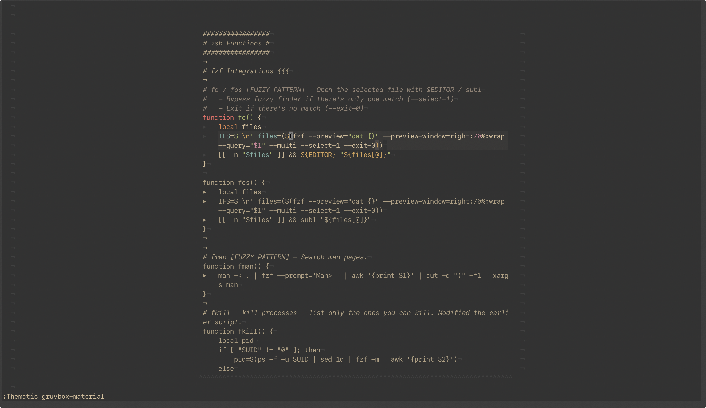
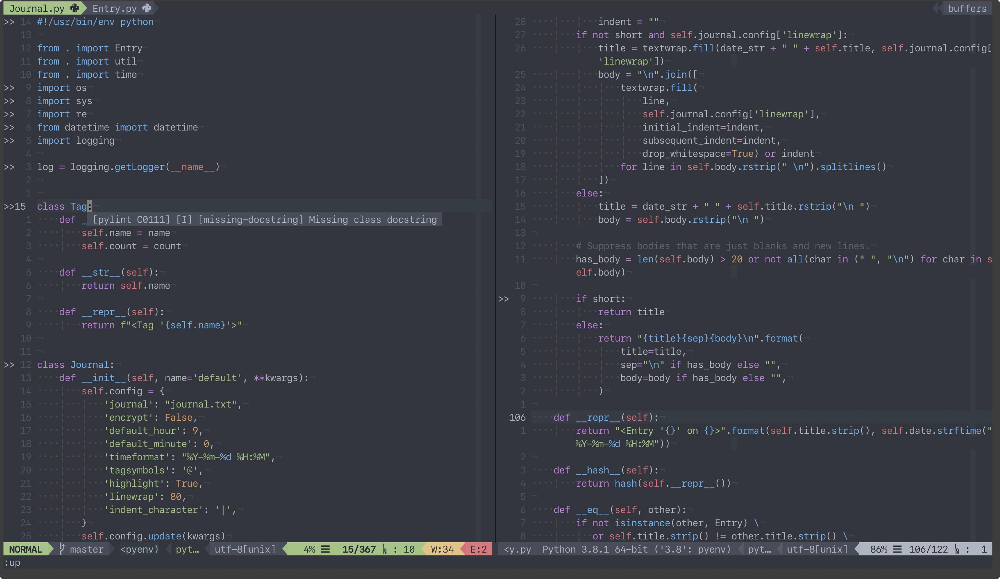
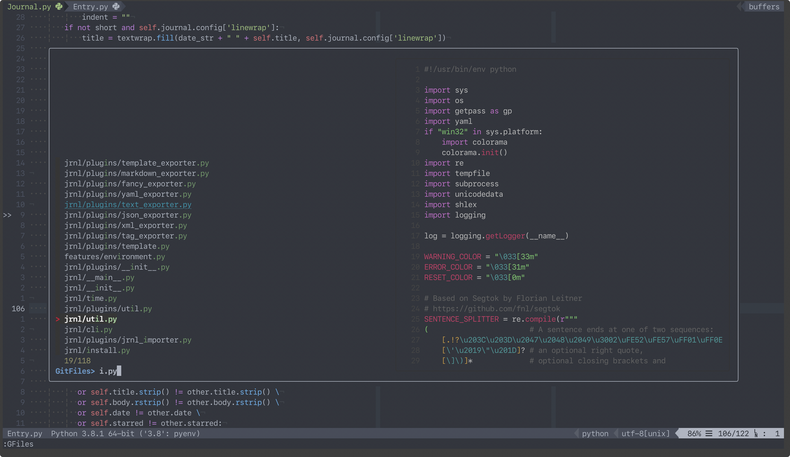
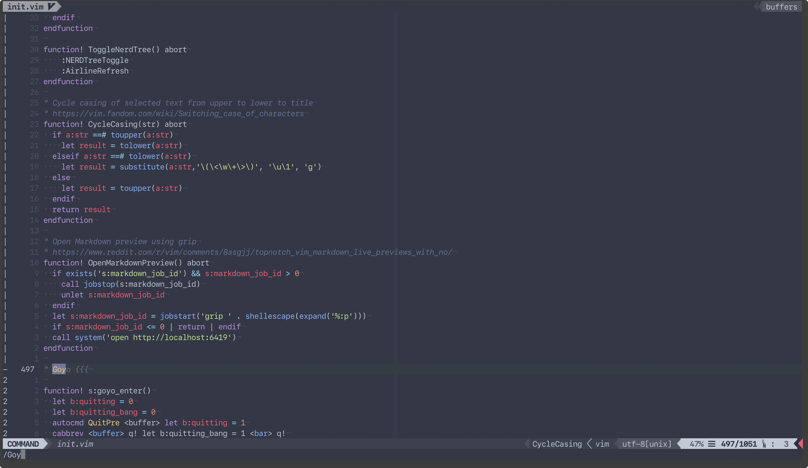
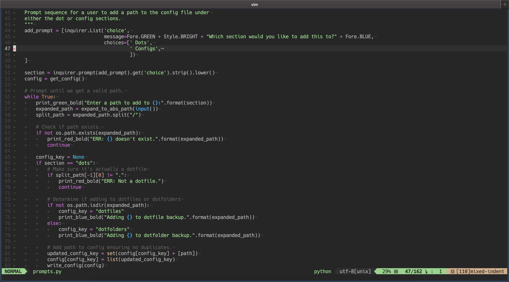
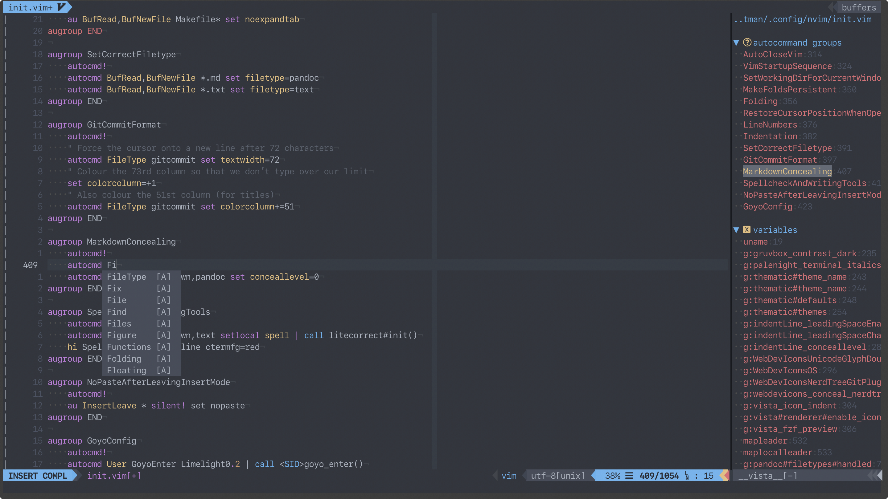

# `alichtman`'s Dotfiles

I manage my dotfiles from `macOS` and `Debian-based Linux` machines simultaneously, so these dotfiles were written with compatibility in mind. The `XDG Base Directory Specification` was followed as much as possible.

Dotfiles managed with [`shallow-backup`](https://github.com/alichtman/shallow-backup/).

My default setup consists mainly of:

- `git`
- `neovim`
- `tmux`
- `zsh`

## `tmux` / `vim` Demos

## Notes

- The `~/.zshenv` file **MUST** be in the `$HOME` directory, however, the rest of the `zsh` config files live in `~/.config/zsh/`.
- These configs depend on a number of external programs which are not all documented in the dotfiles.
- I highly recommend that you do not straight up copy these dotfiles. If you want to use them, read through them and understand how they work. Then take the parts of them that are relevant to your workflow.
