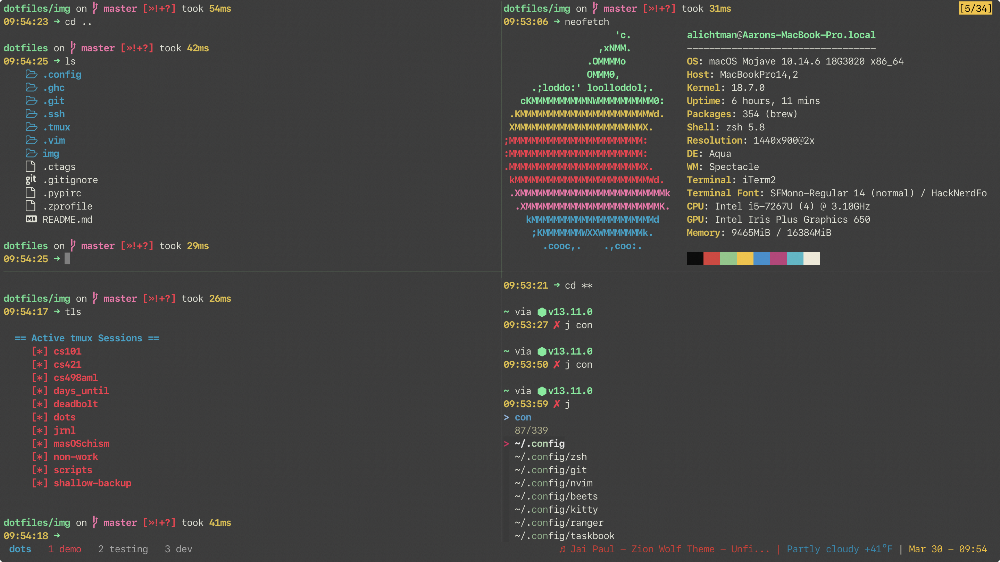
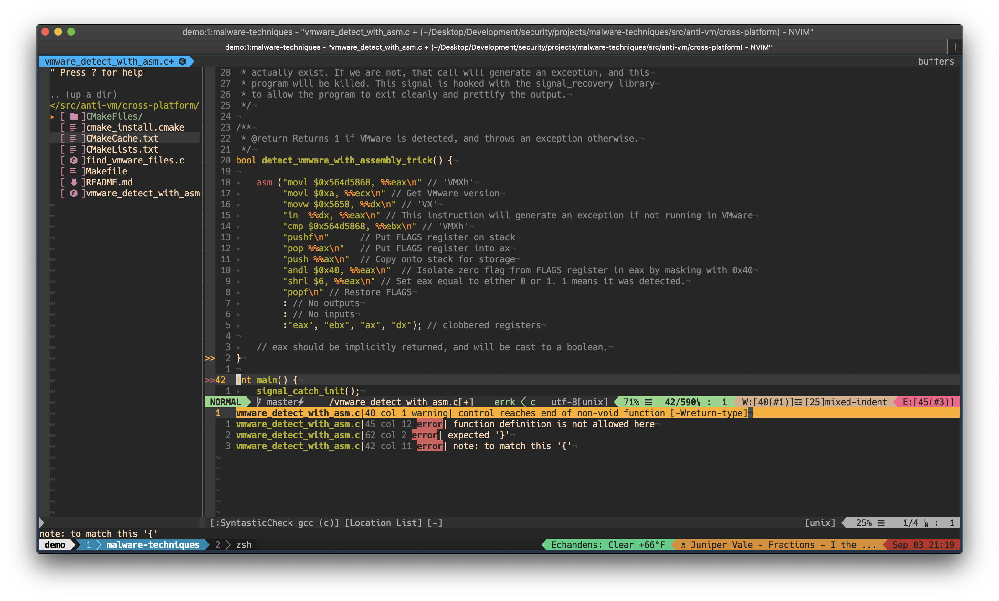

# Aaron's Dotfiles

These are written for `macOS`, but they are `Linux` compatible for the most part. Automatically backed up with [`shallow-backup`](https://github.com/alichtman/shallow-backup).

My default setup consists mainly of:

- `git`
- `tmux`
- `vim`
- `zsh`

## zsh Config

Instead of using the `$ZSH_CUSTOM` directory for custom functions, I wrote mine in `~/.zfunctions` and sourced it in my `~/.zshrc`. Works for me, but definitely not the way it's intended to be done.
